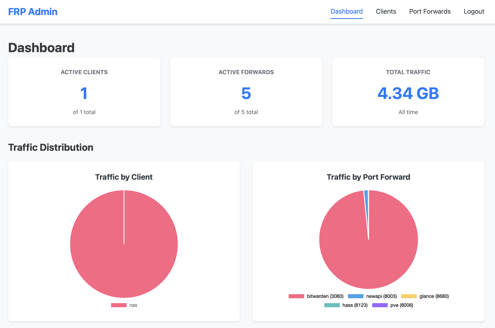
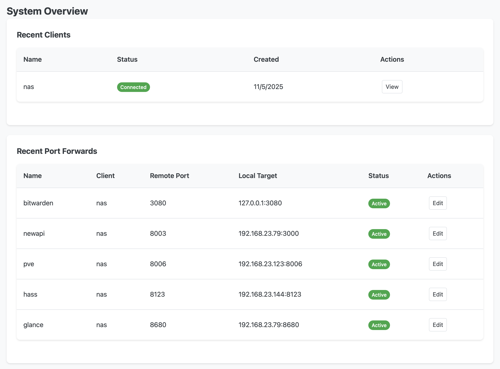

# Node FRP

A Node.js implementation of Fast Reverse Proxy (FRP) for TCP/UDP port forwarding with web-based administration.

## Features

- **TCP/UDP port forwarding** - Forward local services through the server to the internet
- **forwarding/Reverse Forwarding/Dynamic socks5/Reverse Dynamic** - full direction and type support
- **Client/Server architecture** - Centralized server with multiple client support
- **Database-backed configuration** - SQLite database for persistent storage
- **Token-based authentication** - Secure client authentication with auto-generated tokens
- **Web UI Administration** - Full-featured web interface for managing clients and port forwards
- **Real-time status monitoring** - Live connection status tracking
- **Dynamic configuration updates** - Changes take effect immediately without restart
- **Heartbeat mechanism** - Automatic detection and cleanup of dead connections
- **Enable/disable toggles** - Quick control over port forwards without editing
- **REST API** - Programmatic access to all management functions

## WebUI management




## Installation

```bash
npm install -g @qiudaomao/node-frp
```

## Configuration

### Server Configuration (frps.yaml)

```yaml
bindPort: 7000
databasePath: ./frp.db
trafficFlushInterval: 30  # Traffic flush interval in seconds (default: 30)
webUI:
  enabled: true
  port: 8080
  username: admin
  password: admin
```

**Configuration Options:**
- `bindPort` - Control port for client connections (default: 7000)
- `databasePath` - Path to SQLite database file (default: ./frp.db)
- `trafficFlushInterval` - How often to flush traffic statistics to database in seconds (default: 30)
- `webUI.enabled` - Enable/disable web UI (default: true)
- `webUI.port` - Web UI port (default: 8080)
- `webUI.username` - Web UI admin username (default: admin)
- `webUI.password` - Web UI admin password (default: admin)

### Client Configuration (frpc.yaml)

```yaml
serverAddr: "your.server.ip"
serverPort: 7000
token: "your-client-token"
```

*Note: Port forward configuration is now managed through the web UI and is no longer required in the client config.*

## Usage

### Start Server

```bash
node-frp server
node-frp server <frps.yaml>

# run from source
node src/cli.js server
# or with custom config
node src/cli.js server custom-server.yaml
```

The server will automatically start the web UI at http://localhost:8080 (if enabled).

### Start Client

```bash
node-frp client
node-frp client <frpc.yaml>

# run from source
node src/cli.js client
# or with custom config
node src/cli.js client custom-client.yaml
```

## Web UI Administration

The web interface provides complete management capabilities:

- **Dashboard** - Overview with real-time status and statistics
- **Client Management** - Create, view, edit, enable/disable, and delete clients
- **Port Forward Management** - Create, view, edit, enable/disable, and delete port forwards
- **Live Status Updates** - See which clients are connected and which forwards are actively forwarding traffic

### Accessing the Web UI

1. Start the server with web UI enabled (default)
2. Open http://localhost:8080 in your browser
3. Login with the default credentials:
   - Username: `admin`
   - Password: `admin`
4. **Important**: Change the default username and password in the server configuration or environment variables

### Managing Clients

1. **Create a Client**:
   - Navigate to "Clients" → "Add Client"
   - Enter name and description
   - Copy the generated authentication token

2. **Configure Client**:
   - Add the token to the client's `frpc.yaml` file
   - Set `serverAddr` and `serverPort` to point to your server

3. **Monitor Status**:
   - Connected: Client is actively connected to the server
   - Offline: Client is not connected

### Managing Port Forwards

1. **Create Port Forward**:
   - Navigate to "Port Forwards" → "Add Port Forward"
   - Select client and configure ports
   - Remote port: External port on server
   - Local IP/Port: Target service on client machine

2. **Status Indicators**:
   - **Active** (green): Port forward is enabled and client is connected
   - **Client Offline** (yellow): Port forward is enabled but client is disconnected
   - **Disabled** (yellow): Port forward is manually disabled

3. **Traffic Monitoring**:
   - Each port forward displays total traffic (bytes transferred)
   - Traffic updates in real-time (flushed every 30 seconds by default)
   - Hover over traffic numbers to see in/out breakdown
   - Last activity timestamp shows when port forward was last used
   - Traffic persists across server restarts (stored in database)

4. **Quick Actions**:
   - Enable/Disable toggles without editing
   - Delete operations with confirmation
   - All changes take effect immediately for connected clients

## How It Works

1. **Server Setup**:
   - Server starts and initializes SQLite database
   - Web UI starts (if enabled) for administration
   - Server listens on control port (default 7000)

2. **Client Connection**:
   - Client connects to server's control port
   - Client authenticates using token
   - Server retrieves port forward assignments from database
   - Server sends configuration to client

3. **Port Forward Activation**:
   - Server automatically creates proxy listeners for enabled port forwards
   - Only active when client is connected
   - Heartbeat mechanism monitors connection health

4. **Traffic Flow**:
   - External user connects to server's remote port
   - Server notifies client of new connection
   - Client establishes data connection to server
   - Client connects to local service
   - Data flows: External Client ↔ Server ↔ FRP Client ↔ Local Service

5. **Dynamic Updates**:
   - Changes made via web UI take effect immediately
   - Connected clients receive configuration updates in real-time
   - Proxy servers are created/destroyed automatically

## Example Workflow

### Setup Server

**1. Start the server:**
```bash
node src/cli.js server
```

**2. Access Web UI:**
- Open http://localhost:8080
- Login with username: `admin`, password: `admin`

**3. Create a client:**
- Navigate to "Clients" → "Add Client"
- Name: `my-home-server`
- Copy the generated token

**4. Create port forwards:**
- Navigate to "Port Forwards" → "Add Port Forward"
- SSH Forward:
  - Client: `my-home-server`
  - Name: `ssh`
  - Remote Port: `6000`
  - Local IP: `127.0.0.1`
  - Local Port: `22`

### Setup Client

**1. Configure client (frpc.yaml):**
```yaml
serverAddr: "your.server.ip"
serverPort: 7000
token: "paste-token-from-web-ui"
```

**2. Start the client:**
```bash
node src/cli.js client
```

**3. Verify in Web UI:**
- Dashboard should show client as "Connected"
- Port forward should show status as "Active" (green)

### Access Your Service

**Connect to SSH through the tunnel:**
```bash
ssh user@your.server.ip -p 6000
```

## Traffic Monitoring

The FRP server provides real-time traffic monitoring for all port forwards:

### Features
- **Real-time tracking**: Traffic is counted as data flows through connections
- **Periodic updates**: Statistics are flushed to database every 30 seconds (configurable)
- **Persistent storage**: Traffic data survives server restarts
- **Web UI display**:
  - Dashboard shows total traffic across all port forwards
  - Port forwards page shows traffic per forward with last activity timestamp
  - Tooltip displays in/out breakdown on hover

### How It Works
1. **In-memory counters**: As data flows, bytes are tracked in memory for minimal overhead
2. **Periodic flush**: Every N seconds (default 30), accumulated traffic is written to database
3. **Combined view**: Web UI displays database traffic + current in-memory traffic for real-time updates
4. **Graceful shutdown**: Remaining traffic is flushed when server stops

### Configuration
Adjust the flush interval in your server config:
```yaml
trafficFlushInterval: 30  # Flush every 30 seconds
```

Shorter intervals = more frequent database writes but more accurate real-time data
Longer intervals = less database I/O but less frequent updates

## REST API

The server provides a REST API for programmatic access (requires authentication):

### Clients
- `GET /api/clients` - List all clients
- `POST /api/clients` - Create client
- `GET /api/clients/:id` - Get client details
- `PUT /api/clients/:id` - Update client
- `DELETE /api/clients/:id` - Delete client

### Port Forwards
- `GET /api/port-forwards` - List all port forwards with connection status and traffic
- `POST /api/port-forwards` - Create port forward
- `GET /api/port-forwards/:id` - Get port forward details
- `GET /api/port-forwards/:id/traffic` - Get traffic statistics for specific port forward (supports `?since=date`)
- `PUT /api/port-forwards/:id` - Update port forward
- `PUT /api/port-forwards/:id/toggle` - Enable/disable port forward
- `DELETE /api/port-forwards/:id` - Delete port forward

### Statistics
- `GET /api/statistics` - Get system statistics

## Environment Variables

You can override configuration using environment variables:

- `WEB_PORT` - Web UI port (default: 8080)
- `DB_PATH` - Database file path (default: ./frp.db)
- `ADMIN_USERNAME` - Web UI admin username (default: 'admin')
- `ADMIN_PASSWORD` - Web UI admin password (default: 'admin')
- `TRAFFIC_FLUSH_INTERVAL` - Traffic flush interval in seconds (default: 30)

## Architecture

```
┌─────────────────┐
│   Web Browser   │
│  (Port 8080)    │
└────────┬────────┘
         │ HTTP/REST
         ↓
┌─────────────────┐
│   FRP Server    │
│  - Control Port │◄────────┐
│  - Web UI       │         │ Control Connection
│  - Database     │         │ (Authentication & Config)
│  - Proxy Ports  │         │
└────────┬────────┘         │
         │                  │
         │ Proxy Traffic    │
         ↓                  │
┌─────────────────┐    ┌────────────────┐
│ External Client │    │   FRP Client   │
│                 │    │ - Heartbeat    │
└─────────────────┘    │ - Local Conns  │
                       └───────┬────────┘
                               │
                               ↓
                       ┌───────────────┐
                       │ Local Service │
                       │ (SSH, HTTP,   │
                       │  etc.)        │
                       └───────────────┘
```

## Security Considerations

- **Change default credentials**: Update `username` and `password` in server config or use environment variables
- **Use strong passwords**: Choose complex passwords for production environments
- **Use strong tokens**: Tokens are auto-generated with crypto.randomBytes
- **HTTPS**: Consider placing Web UI behind reverse proxy with SSL
- **Firewall**: Only expose necessary ports (control port and proxy ports)
- **Session management**: Sessions expire after 24 hours of inactivity

## Troubleshooting

### Client won't connect
- Verify server IP and port in client config
- Check token is correct
- Ensure firewall allows connection to control port

### Port forward shows "Client Offline"
- Check client is running and connected
- Verify in Dashboard that client shows "Connected"
- Review server/client logs for errors

### Port forward disabled unexpectedly
- Someone may have toggled it via Web UI
- Check if client was deleted (cascades to port forwards)

### "Port already in use" error
- Another process is using the port
- Check for orphaned processes: `netstat -tulpn | grep <port>`
- Restart the server to clean up connections

## License

MIT
